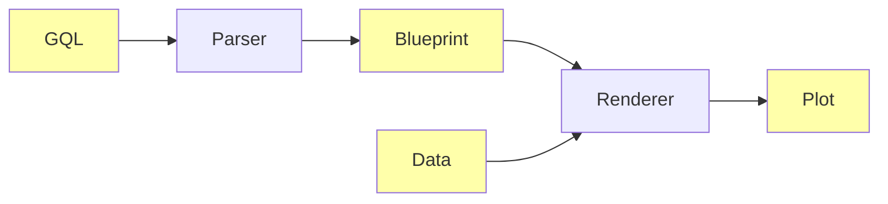
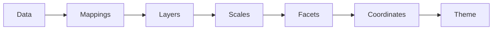
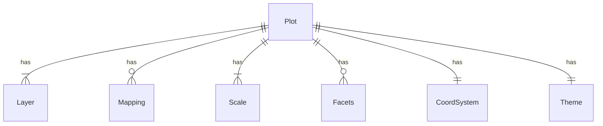
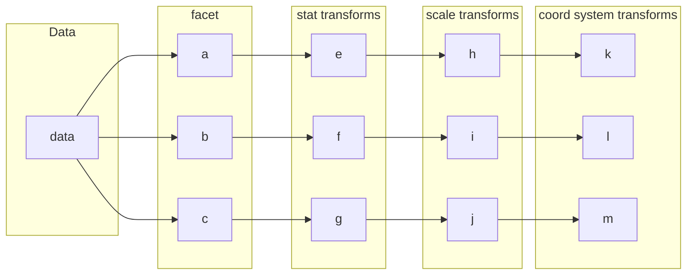
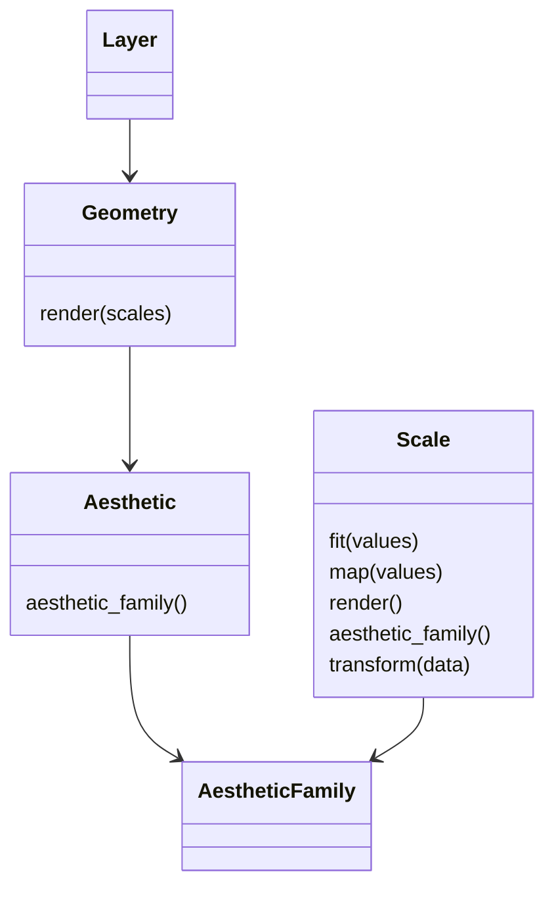

# Grammar of Graphics

A ggplot2-inspired statistical graphics engine written in Rust, using wgpu for GPU-accelerated rendering. The system has two components: a DSL compiler for a language called GQL (Grammar of Graphics Language), and a rendering engine that produces plots from a `Blueprint` specification.

## Goals

- A declarative, language-independent visualization definition (GQL)
- High-performance native rendering suitable for large datasets and interactivity
- Grammar-of-graphics compositional model (layers, scales, aesthetics, stats, facets)

## Running

```bash
cargo run --bin plot file.gg data.csv   # compile + render
cargo run -- path.gg                    # parser (prints statement types)
```

## GQL

GQL is a language based on the ggplot2 API and the grammar of graphics.

```
MAP x=:x, y=:y
GEOM POINT

MAP x=:day, y=:price, group=:ticker, color=:ticker
GEOM LINE
```


## Pipeline



## Plot Layers



## Plot ERD



## Plot generation process



## Scale detail

A **Scale** owns the mapping of a visual channel to the data. For example, mapping a data point to a position along the X axis.

It can also apply additional transformations to the data, before any statistical summary operations within layers. For example, log-transforming the x axis before computing bins for a histogram.

A different example is a discrete color scale, which maps each distinct value for a variable to specific colors.

### Relationship to layers

**Scales** are shared across all **Layers**; this ensures a single visual channel is consistenty mapped over the entire plot.

The **Scales** `ScalePositionContinuous(Axis::X)`, `ScaleLogXContinuous` and `ScaleXDiscrete` all control the horizontal positioning of plot elements. They all belong to the same **AestheticFamily** (`HorizontalPosition`), and thus they are mutually exclusive.

**Scale** transformations are applied first in the rendering pipeline. Then, each layer is given a copy of the transformed and mapped data for further transformation. After running transformations for a layer, the plot's scales are updated based on the data.

Finally, the layer uses the scale to map values from data space to visual space. This must be owned by the layer because some stat transforms change the values that need to be mapped -- e.g. geom_bar adds `width` and `height` **Mappings** which are ultimately mapped to the x and y axis sales.

For each **Mapping** that it needs to map, the **Layer** will scan the plot's **Scales** until it finds a scale in the **AestheticFamily** for that aesthetic.

AestheticFamily examples:
* horizontal position (x continuous, x discrete, log x)
* vertical position
* color
* shape
* size (area, width, height)



## Putting it together

### Histogram

Two **Scales**:
- ScaleXContinuous
- ScaleYContinuous

One **Layer**:
- Stat `bin`: converts values to binned values
- Geom Histogram: Draw a rectangle showing count of values in each bin

**Coord** Cartesian

No **Facets**.

The scales store the limits of the x and y values. The y values are not known until after `stat_bin` from the layer runs. So scale transforms may run before layer stats, but the scales *can* be mutated by the layers.

So the process looks like:
1. Scale transforms: (no op)
2. Stat transforms: bin (bin x and map counts to y)
3. Update scales (y now exists, update limits)
5. Draw scales: xaxis and yaxis
6. Draw layers: bars

### Lineplot with different color lines, log scale on Y, points marked with different shapes, faceted by day_of_week, with free scales

```
GEOM LINE {x=:x, y=:y, group=:group, color=:group}
GEOM POINT {x=:x, y=:y, shape=:group}
FACET BY :day_of_week SCALES FREE
```

Four **Scales**:
- ScaleXContinuous
- ScaleYLog
- ScaleColorDiscrete
- ScaleShape

Two **Layers**:
1. geom line, stat identity
2. geom point, stat identity

**Coord** Cartesian

**Facet** over `day_of_week`
- Free scales, so every facet has its own axis and color legend

This is a more complicated example, but the process *should* be the same.

1. Scale transforms: Log transform `y`
2. Stat transforms: (no op)
5. Facet:
    - partition data
    - update scales if set to `free`
5. Draw scales:
    - Get limits for xaxis and yaxis
    - Assign glyphs and colors
    - xaxis and yaxis (log scale)
    - The line color and point shape scales can be combined in this case.
6. Draw layers
    - Colored lines
    - Shape points

One thing this shows is that because of multiple layers, you shouldn't overwrite mapped variables with transformed counterparts. It probably makes sense to treat the rendering of different layers as separate pipelines that each operate on an independent copy of the parameters. Thus, a chain is formed.

Scale -> Stat -> Facet

**Example**

Raw data
```
x: [1,2,3,4,5]
y: [10,100,1000,10000,100000]
group: [1,2,1,2,1]
day_of_week: ['M','T','M','T','T']
```

Apply scale transformations
```
x: [1,2,3,4,5]
y: [1,2,3,4,5]
group: [1,2,1,2,1]
day_of_week: ['M','T','M','T','T']
```

Facet
```
x: [2,4,5]
y: [2,4,5]
group: [2,2,1]
day_of_week: ['T','T','T']


x: [1,3]
y: [1,3]
group: [1,1]
day_of_week: ['M','M']
```

Scales:
- x: 0-6
- y: 0-6
- color: { 1: "#f00", 2: "#00f" }
- shapes: { 1: "triangle", 2: "square" }


# Reference

[1] https://byrneslab.net/classes/biol607/readings/wickham_layered-grammar.pdf
